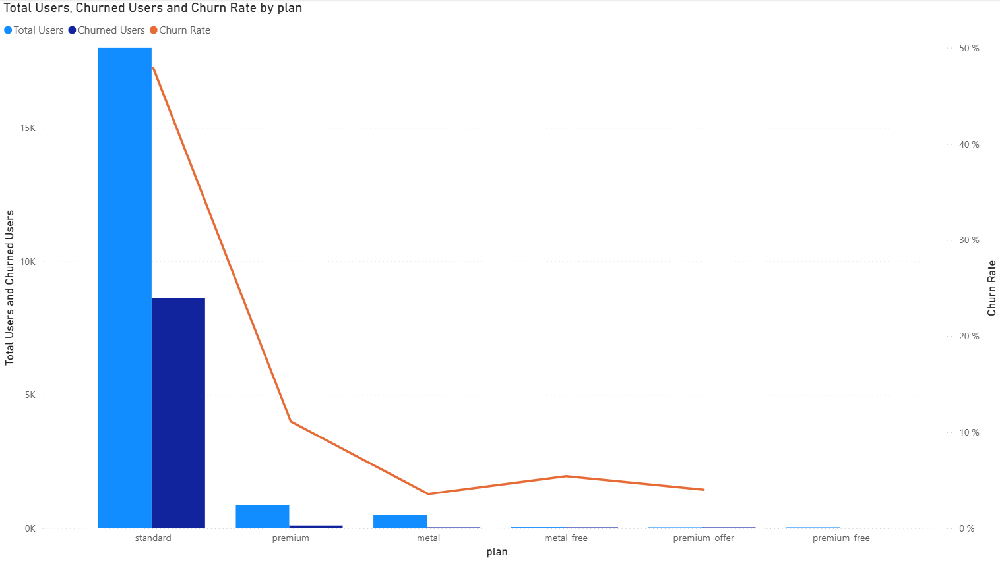
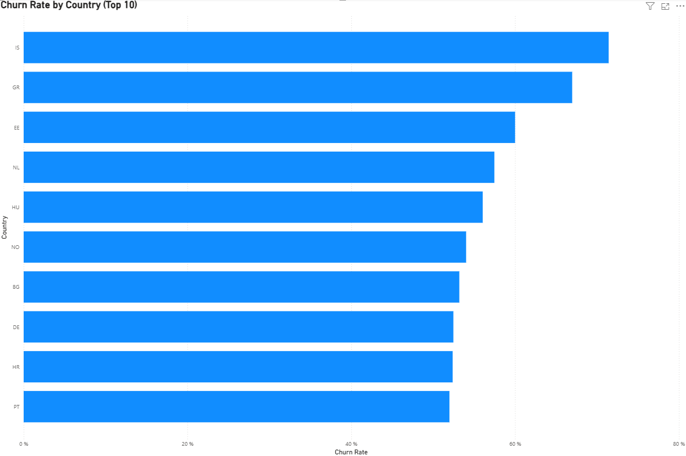
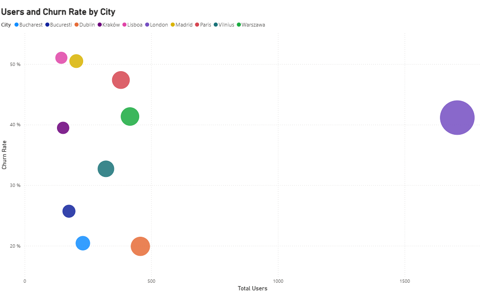

# Neo Bank Churn Analysis

## 📌 Overview
This project analyzes customer churn in a neo-bank using transactional and behavioral data.

The goal is to identify **key drivers of churn**, understand user behavior, and build a **user-level analytical dataset** to support business decision-making and improve retention.

---

## 🎯 Objectives
- Define churn (**30 days of inactivity based on completed transactions**)
- Clean and prepare multiple datasets
- Build a **user-level dataset (`user_activity`)**
- Analyze churn patterns across plans, countries, and cities
- Provide actionable business recommendations

---

## 🛠️ Tools & Technologies
- Python (pandas)
- SQL
- Power BI
- GitHub

---

## 📊 Data Preparation

The analysis is based on multiple datasets:

- `users.csv` → user information and subscription plan  
- `devices.csv` → device-related data  
- `notifications.csv` → communication exposure  
- `transactions.csv` → user activity (**not included, see note below**)  

---

## ⚠️ Important Note
The original `transactions.csv` dataset is **not included** in this repository due to its large size.

Instead, the analysis relies on an aggregated user-level dataset:

👉 **`user_activity.csv`**  
This dataset summarizes user behavior and is used for all churn analyses.

---

## 🧠 Data Processing (Python Notebooks)

All data preparation steps were performed using Python notebooks:

- `notebooks/users_cleaning.ipynb`  
  → Cleaning and preprocessing of user data  

- `notebooks/devices_cleaning.ipynb`  
  → Cleaning and preparation of device data  

- `notebooks/user_activity_feature_engineering.ipynb` ⭐  
  → Core notebook:
  - Aggregation of transactions to user level  
  - Feature engineering (recency, activity, etc.)  
  - Churn definition (30-day inactivity)  
  - Creation of `user_activity.csv`  

---

## 📊 Power BI Dashboard

### 🔹 Churn by Plan

👉 **Standard users show the highest churn rate**, indicating potential issues with entry-level engagement.

---

### 🌍 Churn by Country

👉 Churn varies significantly across countries, suggesting **market-specific behaviors and challenges**.

---

### 🏙️ Users and Churn by City

👉 High user volume does not necessarily imply lower churn, highlighting **behavioral differences across locations**.

---

## 📎 Dashboard Access

👉 [Download the full Power BI dashboard (PDF)](downloads/Neo_Bank-dashboard.pdf)

---

## 📈 Key Insights
- Low user activity is the **strongest predictor of churn**
- Standard plan users have **significantly higher churn rates**
- Churn varies across countries and cities
- Early engagement strongly impacts retention

---

## 💡 Business Recommendations
- Improve onboarding and early user engagement
- Monitor inactivity signals to detect churn risk
- Optimize notification strategy
- Focus retention efforts on high-risk segments

---

## 👩‍💻 My Contribution
- Cleaned and prepared multiple datasets (**users, devices**)
- Defined churn logic based on **30-day inactivity**
- Built a **user-level dataset (`user_activity`)**
- Performed feature engineering (**recency, activity metrics**)
- Developed Power BI dashboards
- Generated insights and business recommendations

---

## 📌 Project Context
This project was completed as part of a **Data Analytics Bootcamp (Le Wagon)** in a team environment.

---

## 📎 Author
**Barbara Le Cornec**  
Junior Data Analyst | Python • SQL • Power BI
